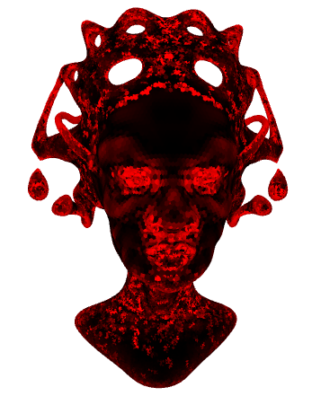
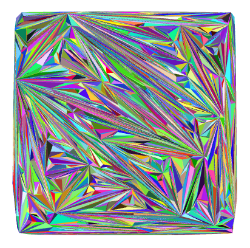
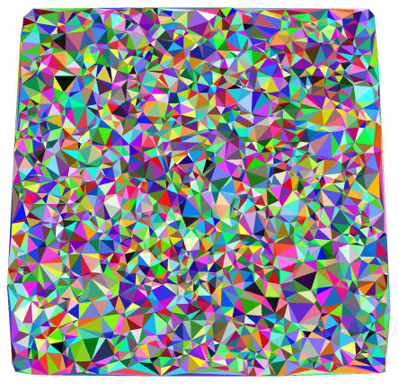
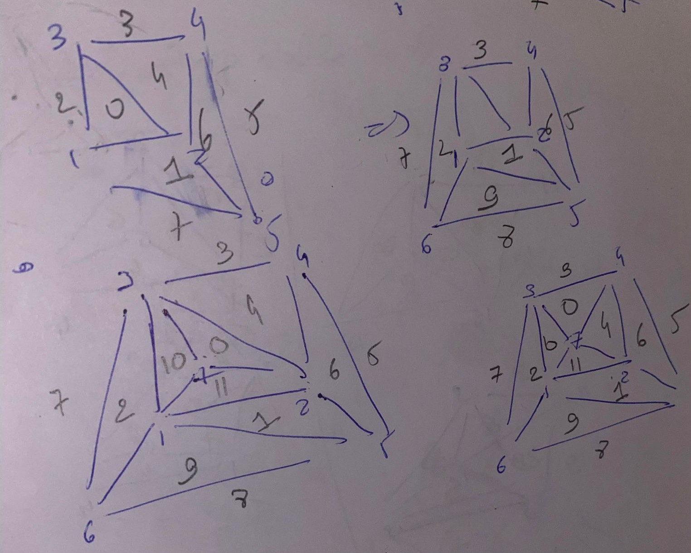
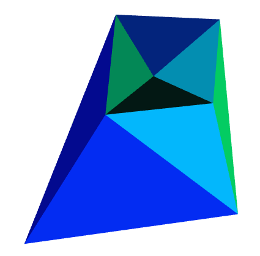

# Computational geometry
This projects aims to import shapes from off files and create data sctructures in order to easily manipulate them, for exemple the method _print_neighbours_ of the mesh class uses the data structure and allows for a givent vertice to show its adjacent faces.  
### TP1-2
This script imports the off files (using the _importFromOFF_ function and at the same time creates the data structure) and computes the laplacians of the given shape using the _computeLaplacianMesh_ util function. Here is an exmple on the _queen_ object : 

### TP3 
Here we start to define the base operations to construct meshes from a set of points in a .txt file. These operations are : 
- _triangleSplit_: which splits a triangle in three when a new vertice appears in that triangle
- _edgeFlip_: which flips an edge on two adjacent triangles
- _outsideSplit_: which does the same as _triangleSplit_ but for vertices outside the mesh (by flipping infinite faces in some cases)

And some predictates to check if a vertice is in the conscripted circle of three other points (_isInCircle_), inside the triangle of these three points (_verticeInTriangle_) or compute the orientation of a point compared to an edge (_orientationTest_).

### TP4
Using these operations we can construct a first naive implementation of the mesh construction. To find the existing triangle containing the new point a visibility search is used (taking in account the infinite faces) 

And using a propagation algorithm at each new point inserted to make the new triangle Delaunay we can then have a better mesh:

An exemple of the construction made of a few points was done in the _simple_delaunay_ files:

